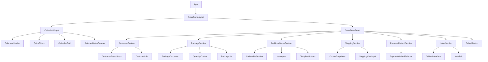
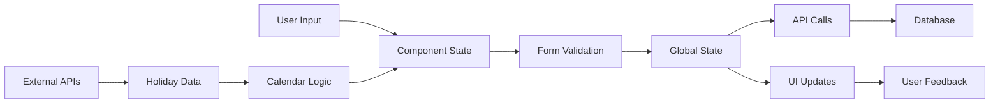

# Component Architecture & Design System

## Component Hierarchy



## Data Flow Architecture



## Component Specifications

### 1. CalendarWidget Component

**Purpose**: Interactive calendar for date selection with Indonesian locale support

**Props Interface**:
```typescript
interface CalendarWidgetProps {
  selectedDates: Set<string>;
  onDateSelect: (date: string) => void;
  onDateDeselect: (date: string) => void;
  onQuickFilter: (filter: 'today' | 'next_month' | '7_days' | '14_days') => void;
  onClear: () => void;
  disabledDates?: Set<string>;
  minDate?: Date;
  maxDate?: Date;
}
```

**Features**:
- Month navigation with arrow buttons
- Multiple date selection with visual feedback
- Quick filter buttons (Hari Ini, Bulan Depan, Clear, 7 Hari, 14 Hari)
- Disabled Sundays and holidays
- Selected dates counter
- Indonesian day names (Sen, Sel, Rab, Kam, Jum, Sab, Min)

**Untitled UI Components Used**:
- Button (for navigation and filters)
- Badge (for selected date count)
- Card (for calendar container)

### 2. CustomerSection Component

**Purpose**: Customer search and selection with autocomplete

**Props Interface**:
```typescript
interface CustomerSectionProps {
  selectedCustomer: Customer | null;
  onCustomerSelect: (customer: Customer) => void;
  customers: Customer[];
  isLoading: boolean;
}

interface Customer {
  id: number;
  name: string;
  address: string;
  defaultShippingCost: number;
}
```

**Features**:
- Real-time search with debouncing (300ms)
- Autocomplete dropdown with keyboard navigation
- Customer address display
- Default shipping cost integration

**Untitled UI Components Used**:
- Input (with search icon)
- Dropdown/Combobox
- Text (for customer info display)

### 3. PackageSection Component

**Purpose**: Package selection with quantity controls

**Props Interface**:
```typescript
interface PackageSectionProps {
  selectedPackages: OrderPackage[];
  availablePackages: Package[];
  onPackageAdd: (packageId: number) => void;
  onPackageRemove: (index: number) => void;
  onQuantityChange: (index: number, quantity: number) => void;
}

interface OrderPackage {
  packageId: number;
  name: string;
  quantity: number;
  price: number;
}
```

**Features**:
- Package dropdown selection
- Quantity increment/decrement controls
- Multiple package support (max 5)
- Real-time price calculation
- Package removal functionality

**Untitled UI Components Used**:
- Select/Dropdown
- Button (for quantity controls)
- Badge (for package count)
- Card (for package list items)

### 4. AdditionalItemsSection Component

**Purpose**: Expandable section for additional items

**Props Interface**:
```typescript
interface AdditionalItemsSectionProps {
  additionalItem: AdditionalItem;
  onItemChange: (item: AdditionalItem) => void;
  onClear: () => void;
  templates: ItemTemplate[];
}

interface AdditionalItem {
  name: string;
  price: number;
  modalPrice: number;
}
```

**Features**:
- Collapsible interface with chevron icon
- Item name and price inputs
- Modal price calculation
- Quick template buttons
- Profit calculation display

**Untitled UI Components Used**:
- Collapsible/Accordion
- Input (for name and prices)
- Button (for templates)
- Text (for calculations)

### 5. ShippingSection Component

**Purpose**: Courier selection and shipping cost management

**Props Interface**:
```typescript
interface ShippingSectionProps {
  selectedCourier: Courier | null;
  shippingCost: number;
  couriers: Courier[];
  onCourierSelect: (courier: Courier) => void;
  onShippingCostChange: (cost: number) => void;
  presetCosts: number[];
}
```

**Features**:
- Courier dropdown selection
- Shipping cost input with validation
- Quick preset cost buttons
- Visual indicator for custom vs standard rates

**Untitled UI Components Used**:
- Select/Dropdown
- Input (number type)
- Button (for presets)
- Badge (for rate indicators)

### 6. PaymentMethodSection Component

**Purpose**: Payment method selection

**Props Interface**:
```typescript
interface PaymentMethodSectionProps {
  selectedMethod: PaymentMethod;
  onMethodSelect: (method: PaymentMethod) => void;
}

type PaymentMethod = 'COD' | 'Transfer' | 'Belum Bayar';
```

**Features**:
- Three payment method options
- Radio button or dropdown selection
- Contextual information for each method
- Payment status indicators

**Untitled UI Components Used**:
- RadioGroup or Select
- Text (for method descriptions)
- Badge (for status indicators)

### 7. NotesSection Component

**Purpose**: Tabbed interface for different note types

**Props Interface**:
```typescript
interface NotesSectionProps {
  notes: OrderNotes;
  onNotesChange: (notes: OrderNotes) => void;
  activeTab: NoteType;
  onTabChange: (tab: NoteType) => void;
}

interface OrderNotes {
  orderNotes: string;
  kitchenNotes: string;
  courierNotes: string;
}

type NoteType = 'order' | 'kitchen' | 'courier';
```

**Features**:
- Three tabs with icons (Order, Kitchen, Courier)
- Text area inputs with character count
- Tab switching with visual feedback
- Template buttons for common notes

**Untitled UI Components Used**:
- Tabs
- Textarea
- Text (for character count)
- Button (for templates)

## Styling System

### Color Tokens
```css
:root {
  /* Background Colors */
  --bg-primary: #0f172a;      /* slate-900 */
  --bg-secondary: #1e293b;    /* slate-800 */
  --bg-tertiary: #334155;     /* slate-700 */
  
  /* Accent Colors */
  --accent-primary: #22c55e;  /* green-500 */
  --accent-secondary: #16a34a; /* green-600 */
  --accent-light: #4ade80;    /* green-400 */
  
  /* Text Colors */
  --text-primary: #f1f5f9;    /* slate-100 */
  --text-secondary: #94a3b8;  /* slate-400 */
  --text-muted: #64748b;      /* slate-500 */
  
  /* Border Colors */
  --border-primary: #475569;  /* slate-600 */
  --border-secondary: #64748b; /* slate-500 */
  
  /* Status Colors */
  --success: #22c55e;         /* green-500 */
  --warning: #f59e0b;         /* amber-500 */
  --error: #ef4444;           /* red-500 */
}
```

### Component Styling Guidelines

#### Input Components
```css
.input-base {
  @apply bg-slate-800 border-slate-600 text-slate-100 placeholder-slate-400;
  @apply focus:border-green-500 focus:ring-green-500/20;
  @apply rounded-lg px-3 py-2 transition-colors;
}

.input-error {
  @apply border-red-500 focus:border-red-500 focus:ring-red-500/20;
}
```

#### Button Components
```css
.btn-primary {
  @apply bg-green-500 hover:bg-green-600 text-white;
  @apply px-4 py-2 rounded-lg font-medium transition-colors;
  @apply focus:outline-none focus:ring-2 focus:ring-green-500/50;
}

.btn-secondary {
  @apply bg-slate-700 hover:bg-slate-600 text-slate-100;
  @apply px-4 py-2 rounded-lg font-medium transition-colors;
}
```

#### Card Components
```css
.card-base {
  @apply bg-slate-800 border border-slate-700 rounded-lg p-4;
  @apply shadow-lg shadow-black/10;
}
```

## Responsive Design Strategy

### Breakpoint System
```css
/* Mobile First Approach */
.container {
  @apply w-full px-4;
}

/* Tablet */
@media (min-width: 768px) {
  .container {
    @apply px-6;
  }
}

/* Desktop */
@media (min-width: 1024px) {
  .container {
    @apply px-8 max-w-7xl mx-auto;
  }
}
```

### Layout Adaptations

#### Mobile Layout (< 768px)
- Single column layout
- Calendar full-width at top
- Form sections stacked vertically
- Larger touch targets (44px minimum)
- Collapsible sections for space efficiency

#### Tablet Layout (768px - 1024px)
- Modified two-column layout
- Calendar in sidebar (collapsible)
- Form takes main content area
- Adjusted spacing and typography

#### Desktop Layout (> 1024px)
- Two-column layout as shown in mockup
- Calendar fixed on left (30% width)
- Form panel on right (70% width)
- Optimal spacing and typography

## State Management Architecture

### Form State Structure
```typescript
interface OrderFormState {
  // UI State
  ui: {
    isLoading: boolean;
    errors: Record<string, string>;
    activeTab: string;
    expandedSections: Set<string>;
  };
  
  // Form Data
  data: {
    customer: Customer | null;
    selectedDates: Set<string>;
    packages: OrderPackage[];
    additionalItems: AdditionalItem;
    shipping: ShippingInfo;
    paymentMethod: PaymentMethod;
    notes: OrderNotes;
  };
  
  // Calculated Values
  calculated: {
    totalPerDay: number;
    totalPayment: number;
    packageSubtotal: number;
    additionalItemsTotal: number;
  };
}
```

### State Management Hooks
```typescript
// Custom hooks for state management
const useOrderForm = () => {
  const [state, dispatch] = useReducer(orderFormReducer, initialState);
  
  // Action creators
  const actions = {
    setCustomer: (customer: Customer) => dispatch({ type: 'SET_CUSTOMER', payload: customer }),
    selectDate: (date: string) => dispatch({ type: 'SELECT_DATE', payload: date }),
    addPackage: (pkg: OrderPackage) => dispatch({ type: 'ADD_PACKAGE', payload: pkg }),
    // ... other actions
  };
  
  return { state, actions };
};
```

## Performance Optimization

### Component Optimization
- Use React.memo for expensive components
- Implement useMemo for complex calculations
- useCallback for event handlers
- Lazy loading for non-critical components

### Bundle Optimization
- Code splitting by route/feature
- Tree shaking for unused code
- Dynamic imports for large dependencies
- Optimize bundle size with Vite

### Runtime Optimization
- Debounced search inputs
- Virtual scrolling for large lists
- Efficient re-rendering strategies
- Memory leak prevention

This architecture provides a solid foundation for building a scalable, maintainable, and performant order management interface using modern React patterns and Untitled UI components.