# Molagis Catering Order System - Database Structure and Logic Documentation

## Overview
This documentation provides a comprehensive analysis of the actual database structure and business logic for the Molagis Catering Order System, based on the real database schema retrieved from Supabase.

## Database Schema

### Entity Relationship Diagram

```mermaid
erDiagram
    CUSTOMERS ||--o{ ORDERS : places
    ORDERS ||--o{ ORDERDETAILS : contains
    ORDERS ||--o{ DELIVERYDATES : has
    PAKET ||--o{ ORDERDETAILS : includes
    COURIERS ||--o{ DELIVERYDATES : delivers
    NEW_CUSTOMERS ||--o{ CUSTOMER_TAGS : has
    TAGS ||--o{ CUSTOMER_TAGS : includes
    CUSTOMERS ||--o{ CUSTOMER_LABELS : assigned
    LABELS ||--o{ CUSTOMER_LABELS : assigned
    EXPENSE_CATEGORIES ||--o{ FINANCIAL_RECORDS : categorizes

    CUSTOMERS {
        int id PK
        text nama
        text alamat
        text telepon
        text telepon_alt
        text maps
        numeric ongkir
        varchar notion_id
        date date_created
        text telepon_pemesan
    }

    PAKET {
        int id PK
        varchar nama
        text deskripsi
        numeric harga_modal
        numeric harga_jual
        int urutan
    }

    COURIERS {
        int id PK
        varchar nama
        varchar telepon
        text alamat
        boolean aktif
        text color
    }

    ORDERS {
        int id PK
        int customer_id FK
        date tanggal_pesan
        numeric total_harga
        text notes
        varchar metode_pembayaran
        boolean is_deleted
        timestamp update_date
    }

    DELIVERYDATES {
        int id PK
        int order_id FK
        date tanggal
        int kurir_id FK
        numeric ongkir
        varchar status
        text item_tambahan
        numeric harga_tambahan
        numeric total_harga_perhari
        numeric total_modal_perhari
        numeric harga_modal_tambahan
        text courier_note
        text kitchen_note
        numeric ongkir_kurir_luar
        timestamp time_completed
    }

    ORDERDETAILS {
        int id PK
        int delivery_id FK
        int paket_id FK
        int jumlah
        numeric subtotal_harga
        numeric subtotal_modal
        text catatan_dapur
        text catatan_kurir
        timestamp created_at
    }

    NEW_CUSTOMERS {
        bigint id PK
        timestamp created_at
        text name_original
        text name_saved
        numeric phone
        text label
    }

    TAGS {
        bigint id PK
        text tag_name
        timestamp created_at
        text color
    }

    CUSTOMER_TAGS {
        bigint customer_id PK,FK
        bigint tag_id PK,FK
        timestamp created_at
    }

    LABELS {
        int id PK
        varchar name
        text description
        varchar color
    }

    CUSTOMER_LABELS {
        int customer_id PK,FK
        int label_id PK,FK
    }

    FINANCIAL_RECORDS {
        bigint id PK
        date transaction_date
        numeric amount
        text type
        text description
        int category_id FK
        timestamp created_at
    }

    EXPENSE_CATEGORIES {
        int id PK
        varchar name
        varchar display_name
        text description
        timestamp created_at
    }

    WEEKLY_REPORTS {
        int id PK
        int omset
        int modal
        int ongkir
        int total_pengeluaran
        int total_pemasukan
        int profit_kotor
        int profit_bersih
        int minggu_ke
        int tahun
        timestamp created_at
    }

    BUFFER {
        bigint id PK
        timestamp created_at
        json format_order_parsed
        text format_order_plain
        text full_telegram_msg
        numeric chatwoot_conv_id
        numeric chatwoot_msg_id
        text wa_msg_id
        boolean done
    }

    WA_MEDIA {
        int id PK
        timestamp created_at
        timestamp received_at
        text wa_key_id
        text wa_identifier
        text wa_instance_id
    }

    WA_STICKER {
        bigint id PK
        timestamp created_at
        text hash
    }

    SETTINGS {
        uuid id PK
        varchar key
        text value
        timestamp created_at
        timestamp updated_at
    }

    PROFILES {
        uuid id PK
        text first_name
        text last_name
        text display_name
        text role
        text email
    }

    QURAN_PER_PAGE {
        int page_number PK
        int surah_number
        int ayah_number
        text text_uthmani
        text surah_name
        text surah_english_name
        text surah_english_name_translation
        text revelation_type
    }
```


### Table Structures

#### 1. Customers Table
```sql
CREATE TABLE customers (
    id SERIAL PRIMARY KEY,
    nama TEXT NOT NULL,
    alamat TEXT,
    telepon TEXT,
    telepon_alt TEXT,
    maps TEXT,
    ongkir NUMERIC,
    notion_id VARCHAR,
    date_created DATE DEFAULT NOW(),
    telepon_pemesan TEXT
);
```

#### 2. Packages Table (paket)
```sql
CREATE TABLE paket (
    id SERIAL PRIMARY KEY,
    nama VARCHAR NOT NULL,
    deskripsi TEXT,
    harga_modal NUMERIC NOT NULL,
    harga_jual NUMERIC NOT NULL,
    urutan INTEGER
);
```

#### 3. Couriers Table
```sql
CREATE TABLE couriers (
    id SERIAL PRIMARY KEY,
    nama VARCHAR NOT NULL,
    telepon VARCHAR,
    alamat TEXT,
    aktif BOOLEAN,
    color TEXT -- warna untuk ditampikan di UI frontend
);
```

#### 4. Orders Table
```sql
CREATE TABLE orders (
    id SERIAL PRIMARY KEY,
    customer_id INTEGER REFERENCES customers(id),
    tanggal_pesan DATE NOT NULL,
    total_harga NUMERIC,
    notes TEXT,
    metode_pembayaran VARCHAR DEFAULT 'belum_bayar' CHECK (metode_pembayaran IN ('cod', 'transfer', 'belum_bayar')),
    is_deleted BOOLEAN DEFAULT false,
    update_date TIMESTAMP WITH TIME ZONE DEFAULT NOW()
);
```

#### 5. Delivery Dates Table (deliverydates)
```sql
CREATE TABLE deliverydates (
    id SERIAL PRIMARY KEY,
    order_id INTEGER REFERENCES orders(id),
    tanggal DATE NOT NULL,
    kurir_id INTEGER REFERENCES couriers(id),
    ongkir NUMERIC NOT NULL,
    status VARCHAR DEFAULT 'pending' CHECK (status IN ('pending', 'in-progress', 'completed', 'canceled')),
    item_tambahan TEXT,
    harga_tambahan NUMERIC,
    total_harga_perhari NUMERIC NOT NULL,
    total_modal_perhari NUMERIC,
    harga_modal_tambahan NUMERIC,
    courier_note TEXT,
    kitchen_note TEXT,
    ongkir_kurir_luar NUMERIC,
    time_completed TIMESTAMP WITH TIME ZONE
);
```

#### 6. Order Details Table (orderdetails)
```sql
CREATE TABLE orderdetails (
    id SERIAL PRIMARY KEY,
    delivery_id INTEGER REFERENCES deliverydates(id),
    paket_id INTEGER REFERENCES paket(id),
    jumlah INTEGER NOT NULL,
    subtotal_harga NUMERIC,
    subtotal_modal NUMERIC,
    catatan_dapur TEXT,
    catatan_kurir TEXT,
    created_at TIMESTAMP WITH TIME ZONE DEFAULT CURRENT_TIMESTAMP
);
```

#### 7. New Customers Table
```sql
CREATE TABLE new_customers (
    id BIGSERIAL PRIMARY KEY,
    created_at TIMESTAMP WITH TIME ZONE NOT NULL DEFAULT NOW(),
    name_original TEXT,
    name_saved TEXT,
    phone NUMERIC UNIQUE,
    label TEXT
);
```

#### 8. Tags Table
```sql
CREATE TABLE tags (
    id BIGSERIAL PRIMARY KEY,
    tag_name TEXT UNIQUE NOT NULL,
    created_at TIMESTAMP WITH TIME ZONE NOT NULL DEFAULT NOW(),
    color TEXT
);
```

#### 9. Customer Tags Table
```sql
CREATE TABLE customer_tags (
    customer_id BIGINT REFERENCES new_customers(id),
    tag_id BIGINT REFERENCES tags(id),
    created_at TIMESTAMP WITH TIME ZONE NOT NULL DEFAULT NOW(),
    PRIMARY KEY (customer_id, tag_id)
);
```

#### 10. Labels Table
```sql
CREATE TABLE labels (
    id SERIAL PRIMARY KEY,
    name VARCHAR UNIQUE NOT NULL,
    description TEXT,
    color VARCHAR
);
```

#### 11. Customer Labels Table
```sql
CREATE TABLE customer_labels (
    customer_id INTEGER REFERENCES customers(id),
    label_id INTEGER REFERENCES labels(id),
    PRIMARY KEY (customer_id, label_id)
);
```

#### 12. Financial Records Table
```sql
CREATE TABLE financial_records (
    id BIGSERIAL PRIMARY KEY,
    transaction_date DATE NOT NULL,
    amount NUMERIC NOT NULL,
    type TEXT NOT NULL,
    description TEXT,
    category_id INTEGER REFERENCES expense_categories(id), -- Foreign key yang terhubung ke tabel expense_categories
    created_at TIMESTAMP WITH TIME ZONE NOT NULL DEFAULT NOW()
);
```

#### 13. Expense Categories Table
```sql
CREATE TABLE expense_categories (
    id SERIAL PRIMARY KEY,
    name VARCHAR UNIQUE NOT NULL, -- Nama kategori untuk backend, e.g., 'gaji_dan_upah'
    display_name VARCHAR NOT NULL, -- Nama kategori untuk ditampilkan di UI, e.g., 'Gaji dan Upah'
    description TEXT,
    created_at TIMESTAMP WITH TIME ZONE NOT NULL DEFAULT NOW()
);
```

#### 14. Weekly Reports Table
```sql
CREATE TABLE weekly_reports (
    id SERIAL PRIMARY KEY,
    omset INTEGER NOT NULL,
    modal INTEGER NOT NULL,
    ongkir INTEGER NOT NULL,
    total_pengeluaran INTEGER NOT NULL DEFAULT 0,
    total_pemasukan INTEGER NOT NULL DEFAULT 0,
    profit_kotor INTEGER GENERATED ALWAYS AS (omset - modal) STORED,
    profit_bersih INTEGER GENERATED ALWAYS AS (((omset - modal) - total_pengeluaran) + total_pemasukan) STORED,
    minggu_ke INTEGER NOT NULL,
    tahun INTEGER NOT NULL,
    created_at TIMESTAMP WITHOUT TIME ZONE NOT NULL DEFAULT NOW()
);
```

#### 15. Buffer Table
```sql
CREATE TABLE buffer (
    id BIGSERIAL PRIMARY KEY,
    created_at TIMESTAMP WITH TIME ZONE NOT NULL DEFAULT NOW(),
    format_order_parsed JSON,
    format_order_plain TEXT,
    full_telegram_msg TEXT,
    chatwoot_conv_id NUMERIC,
    chatwoot_msg_id NUMERIC,
    wa_msg_id TEXT,
    done BOOLEAN
);
-- Data simpan sementara keperluan Workflow di Nodemation (otomasiku.my.id)
```

#### 16. WhatsApp Media Table (wa_media)
```sql
CREATE TABLE wa_media (
    id SERIAL PRIMARY KEY,
    created_at TIMESTAMP WITH TIME ZONE NOT NULL DEFAULT NOW(),
    received_at TIMESTAMP WITHOUT TIME ZONE,
    wa_key_id TEXT UNIQUE,
    wa_identifier TEXT,
    wa_instance_id TEXT
);
```

#### 17. WhatsApp Sticker Table (wa_sticker)
```sql
CREATE TABLE wa_sticker (
    id BIGSERIAL PRIMARY KEY,
    created_at TIMESTAMP WITH TIME ZONE NOT NULL DEFAULT NOW(),
    hash TEXT UNIQUE
);
```

#### 18. Settings Table
```sql
CREATE TABLE settings (
    id UUID PRIMARY KEY DEFAULT uuid_generate_v4(),
    key VARCHAR UNIQUE NOT NULL,
    value TEXT NOT NULL,
    created_at TIMESTAMP WITH TIME ZONE DEFAULT CURRENT_TIMESTAMP,
    updated_at TIMESTAMP WITH TIME ZONE DEFAULT CURRENT_TIMESTAMP
);
```

#### 19. Profiles Table
```sql
CREATE TABLE profiles (
    id UUID PRIMARY KEY REFERENCES auth.users(id),
    first_name TEXT,
    last_name TEXT,
    display_name TEXT,
    role TEXT,
    email TEXT
);
```

#### 20. Quran Per Page Table (quran_per_page)
```sql
CREATE TABLE quran_per_page (
    page_number INTEGER PRIMARY KEY,
    surah_number INTEGER NOT NULL,
    ayah_number INTEGER NOT NULL,
    text_uthmani TEXT NOT NULL,
    surah_name TEXT,
    surah_english_name TEXT,
    surah_english_name_translation TEXT,
    revelation_type TEXT
);
```

## RPC Functions

The database implements business logic through a variety of RPC (Remote Procedure Call) functions that can be accessed via the PostgREST API. These functions provide complex operations that involve multiple tables and business rules.

### Order Management Functions

1. `submit_order(params JSONB)` - Handles complete order submission process, including validation and creation of related records across multiple tables.

2. `update_daily_order(p_delivery_id INTEGER, request JSONB)` - Updates a specific delivery order with new information.

### Financial and Reporting Functions

1. `get_outstanding_revenue(p_start_date DATE)` - Calculates outstanding revenue from a specified start date.

2. `get_weekly_metrics(p_week_count INTEGER)` - Retrieves metrics for a specified number of weeks.

3. `get_financial_overview(p_start_date DATE, p_end_date DATE)` - Provides a financial overview for a specified date range.

4. `get_customer_report_data(start_date DATE, end_date DATE)` - Generates customer report data for a specified date range.

5. `get_customer_sales_report(p_start_date DATE, p_end_date DATE)` - Generates a sales report for customers within a date range.

6. `get_daily_revenue_data(start_date DATE, end_date DATE)` - Retrieves daily revenue data for a specified date range.

7. `get_report_summary(start_date DATE, end_date DATE)` - Provides a summary report for a specified date range.

8. `get_total_revenue_from_date(p_start_date DATE)` - Calculates total revenue from a specified start date.

### Delivery Management Functions

1. `get_deliveries_by_date(p_tanggal DATE)` - Retrieves all deliveries for a specific date.

2. `get_deliveries_and_update_status(p_date DATE, p_delivery_ids INTEGER[], p_status VARCHAR)` - Updates the status of multiple deliveries for a specific date.

3. `get_delivery_details(p_courier_id INTEGER, p_date DATE)` - Retrieves detailed information about deliveries for a specific courier on a specific date.

### Pricing and Calculation Functions

1. `test_calculate_and_set_order_total(p_order_id INTEGER)` - Tests and calculates the total for a specific order.

2. `test_update_ongkir_and_recalculate(p_delivery_id INTEGER, p_new_ongkir NUMERIC)` - Tests updating shipping costs and recalculating totals for a delivery.

3. `test_full_update_and_recalculate(p_delivery_id INTEGER, p_new_ongkir NUMERIC)` - Performs a full update and recalculation for a delivery.

4. `update_ongkir_saja(p_delivery_id INTEGER, p_new_ongkir NUMERIC)` - Updates only the shipping cost for a delivery.

5. `fix_incorrect_delivery_modals()` - Fixes incorrect delivery modal values.

### Data Integrity Functions

1. `find_mismatched_totals()` - Identifies orders with mismatched totals.

2. `find_mismatched_subtotals(p_start_date DATE, p_end_date DATE)` - Identifies order details with mismatched subtotals within a date range.

3. `find_mismatched_order_totals(p_start_date DATE, p_end_date DATE)` - Identifies orders with mismatched totals within a date range.

### Utility Functions

1. `get_timezone()` - Retrieves the current timezone setting.

## Business Logic

1. **Order Creation**: Orders are created with a reference to a customer and a pesan date. Each order can have multiple delivery dates. The `submit_order` RPC function handles the complete order submission process, including validation and creation of related records across multiple tables.

2. **Delivery Management**: Each order can have multiple delivery dates, with each delivery date having its own courier assignment, shipping cost, and status. Delivery statuses include 'pending', 'in-progress', 'completed', and 'canceled'. The system provides several RPC functions for managing deliveries, including updating statuses and retrieving delivery details.

3. **Order Details**: For each delivery date, there can be multiple order details referencing different packages with quantities and pricing information. The system tracks both selling price (harga_jual) and cost price (harga_modal) for packages, and calculates profits at various levels.

4. **Pricing**: The system implements complex pricing logic with support for additional items, shipping costs, and various pricing tiers. Several RPC functions are available for testing and updating pricing calculations.

5. **Customer Management**: Customers have detailed contact information and default shipping costs. They can also be assigned labels and tags for categorization. New customers are automatically saved when they contact via WhatsApp.

6. **Payment**: Three payment methods are supported: COD, Transfer, and Belum Bayar. Payment information is tracked at the order level.

7. **Financial Tracking**: The system tracks financial records with categories for expenses and income, and generates weekly reports. Various RPC functions provide financial reporting capabilities, including revenue calculations and financial overviews.

8. **Messaging Integration**: The system integrates with WhatsApp and other messaging platforms through buffer tables and media storage. WhatsApp stickers and media are stored with unique identifiers.

9. **User Management**: User profiles are maintained with role-based access control.

10. **Data Integrity**: The system includes several functions for identifying and correcting data inconsistencies, such as mismatched totals and subtotals.

## CRM Enhancements (August 2025)

### New Views
1. **customer_last_order** - A view that efficiently retrieves the last order date for each customer without modifying the main customers table. This provides real-time last order date information while maintaining data integrity.

### New RPC Functions
1. **get_customers_with_last_order(search_term TEXT DEFAULT '')** - Retrieves customer list with last order date information, supporting search functionality across customer name, address, and phone number.

2. **get_customer_crm_stats()** - Provides CRM statistics overview including total customers, active customers (last order within 90 days), inactive customers, and new customers (created within last 30 days).

3. **get_customers_by_activity(activity_status TEXT DEFAULT 'all', search_term TEXT DEFAULT '')** - Retrieves customers filtered by activity status (active/inactive/all) with search capabilities.

### CRM Business Logic
- **Active Customer Definition**: Last order date within 90 days OR no orders (new customers)
- **Inactive Customer Definition**: Last order date older than 90 days
- **New Customer Definition**: Customer created within last 30 days
- **Days Since Last Order**: Calculated metric for customer engagement tracking

## Business Logic

1. **Order Creation**: Orders are created with a reference to a customer and a pesan date. Each order can have multiple delivery dates. The `submit_order` RPC function handles the complete order submission process, including validation and creation of related records across multiple tables.

2. **Delivery Management**: Each order can have multiple delivery dates, with each delivery date having its own courier assignment, shipping cost, and status. Delivery statuses include 'pending', 'in-progress', 'completed', and 'canceled'. The system provides several RPC functions for managing deliveries, including updating statuses and retrieving delivery details.

3. **Order Details**: For each delivery date, there can be multiple order details referencing different packages with quantities and pricing information. The system tracks both selling price (harga_jual) and cost price (harga_modal) for packages, and calculates profits at various levels.

4. **Pricing**: The system implements complex pricing logic with support for additional items, shipping costs, and various pricing tiers. Several RPC functions are available for testing and updating pricing calculations.

5. **Customer Management**: Customers have detailed contact information and default shipping costs. They can also be assigned labels and tags for categorization. New customers are automatically saved when they contact via WhatsApp.

6. **Payment**: Three payment methods are supported: COD, Transfer, and Belum Bayar. Payment information is tracked at the order level.

7. **Financial Tracking**: The system tracks financial records with categories for expenses and income, and generates weekly reports. Various RPC functions provide financial reporting capabilities, including revenue calculations and financial overviews.

8. **Messaging Integration**: The system integrates with WhatsApp and other messaging platforms through buffer tables and media storage. WhatsApp stickers and media are stored with unique identifiers.

9. **User Management**: User profiles are maintained with role-based access control.

10. **Data Integrity**: The system includes several functions for identifying and correcting data inconsistencies, such as mismatched totals and subtotals.

11. **CRM Analytics**: The system now includes CRM analytics capabilities through specialized views and RPC functions for customer engagement tracking and segmentation.

This documentation provides the necessary context for future coding tasks related to the database layer of the Molagis Catering Order System, based on the actual database structure and implemented business logic.